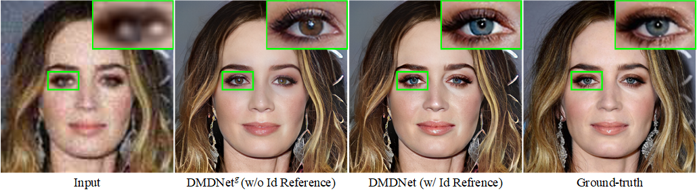
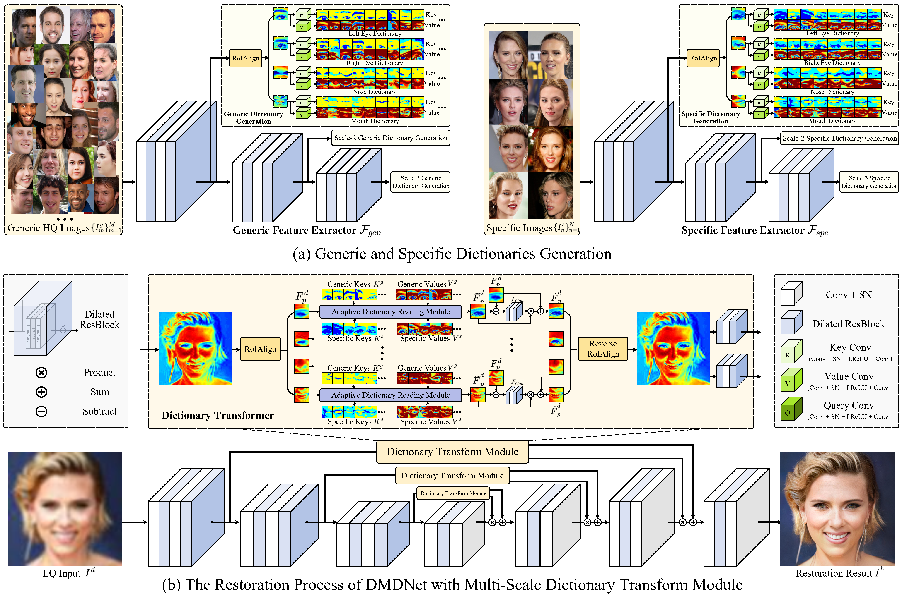

## [Learning Dual Memory Dictionaries for Blind Face Restoration](#)
> The proposed CelebRef-HQ dataset has been released ([see below](#jump)). All code and model will be available on November.

### Motivation
<p align="justify"> These blind face restoration methods easily change the personal details when handling the severely degraded input. So it is necessary to introduce the high-quality reference from the same identity to keep the personalized textures. See the following examples.
</p>

<div align=center>

</div>

### Abstract
<p align="justify">Blind face restoration is a challenging task due to the unknown, unsynthesizable and complex degradation, yet is valuable in many practical applications. To improve the performance of blind face restoration, recent works mainly treat the two aspects, i.e., generic and specific restoration, separately. In particular, generic restoration attempts to restore the results through general facial structure prior, while on the one hand, cannot generalize to real-world degraded observations due to the limited capability of direct CNNs' mappings in learning blind restoration, and on the other hand, fails to exploit the identity-specific details. On the contrary, specific restoration aims to incorporate the identity features from the reference of the same identity, in which the requirement of proper reference severely limits the application scenarios. Generally, it is a challenging and intractable task to improve the photo-realistic performance of blind restoration and adaptively handle the generic and specific restoration scenarios with a single unified model. Instead of implicitly learning the mapping from a low-quality image to its high-quality counterpart, this paper suggests a DMDNet by explicitly memorizing the generic and specific features through dual dictionaries. First, the generic dictionary learns the general facial priors from high-quality images of any identities, while the specific dictionary stores the identity-belonging features for each person individually. Second, to handle the degraded input with or without specific reference, dictionary transform module is suggested to read the relevant details from the dual dictionaries which are subsequently fused into the input features. Finally, multi-scale dictionaries are leveraged to benefit the coarse-to-fine restoration. The whole framework including the generic and specific dictionaries is optimized in an end-to-end manner and can be flexibly plugged into different application scenarios. Moreover, a new high-quality dataset, termed CelebRef-HQ, is constructed to promote the exploration of specific face restoration in the high-resolution space. Experimental results demonstrate that the proposed DMDNet performs favorably against the state of the arts in both quantitative and qualitative evaluation, and generates more photo-realistic results on the real-world low-quality images. </p>
<div align=center>

</div>

<div align=center>

</div>
<div align=center>
(c) Adaptive Dictionary Reading Module
</div>


## <span id="jump">CelebRef-HQ dataset</span>
<p align="justify">
This CelebRef-HQ dataset contains 1,005 identities, which has a total of 10,555 images and covers different genders, poses, expressions, etc. Each person has 3~20 images. We hope this would benefit the reference-based face restoration on high-resolution space (512*512). See the following example of one person.
</p>
<div align=center>

</div>


### Agreement
- This CelebRef-HQ dataset is available for non-commercial research purposes only.
- All images were obtained from the Internet which are not property of our institutions. Our institutions are not responsible for the content nor the meaning of these images.
- You agree not to reproduce, duplicate, copy, sell, trade, resell or exploit for any commercial purposes, any portion of the images and any portion of derived data.
- You agree not to further copy, publish or distribute any portion of this CelebRef-HQ dataset. 

You can download this dataset from the following link:
- [BaiduNetDisk]()
or
- [GoogleDrive](https://drive.google.com/file/d/1uzVookgAXN2HcgF1AHd_sF6nORDHt9nU/view?usp=sharing)

## Acknowledgement
This project is built based on the excellent [BasicSR](https://github.com/XPixelGroup/BasicSR), [KAIR](https://github.com/cszn/KAIR) and [CelebV-HQ](https://github.com/CelebV-HQ/CelebV-HQ).


## Citation

```
@article{li2022learning,
title = {Learning Dual Memory Dictionaries for Blind Face Restoration},
author = {Li, Xiaoming and Zhang, Shiguang and Zhou, Shangchen and Zhang, Lei and Zuo, Wangmeng},
journal = {IEEE Transactions on Pattern Analysis and Machine Intelligence},
year = {2022}
}
```

<details close><summary><h2>Our other blind face restoration related works:</h2></summary>
  
(1) **Single** Reference based **Specific** Restoration ([GFRNet](https://github.com/csxmli2016/GFRNet))

```
@InProceedings{Li_2018_ECCV,
author = {Li, Xiaoming and Liu, Ming and Ye, Yuting and Zuo, Wangmeng and Lin, Liang and Yang, Ruigang},
title = {Learning Warped Guidance for Blind Face Restoration},
booktitle = {ECCV},
year = {2018}
}
```

(2) **Multiple Exemplar** based **Specific** Restoration ([ASFFNet](https://github.com/csxmli2016/ASFFNet512))

```
@InProceedings{Li_2020_CVPR,
author = {Li, Xiaoming and Li, Wenyu and Ren, Dongwei and Zhang, Hongzhi and Wang, Meng and Zuo, Wangmeng},
title = {Enhanced Blind Face Restoration with Multi-Exemplar Images and Adaptive Spatial Feature Fusion},
booktitle = {CVPR},
year = {2020}
}
```

(3) Component Dictionary based **Generic** Restoration ([DFDNet](https://github.com/csxmli2016/DFDNet))

```
@InProceedings{Li_2020_ECCV,
author = {Li, Xiaoming and Chen, Chaofeng and Zhou, Shangchen and Lin, Xianhui and Zuo, Wangmeng and Zhang, Lei},
title = {Blind Face Restoration via Deep Multi-scale Component Dictionaries},
booktitle = {ECCV},
year = {2020}
}
```

(4) Dual Memory based **Generic and Specific** Restoration (this work [DMDNet](https://github.com/csxmli2016/DMDNet))

```
@article{li2022learning,
title = {Learning Dual Memory Dictionaries for Blind Face Restoration},
author = {Li, Xiaoming and Zhang, Shiguang and Zhou, Shangchen and Zhang, Lei and Zuo, Wangmeng},
journal = {IEEE Transactions on Pattern Analysis and Machine Intelligence},
year = {2022}
}
```
  
(5) Learning Real-world Degradation from Face Images ([ReDegNet](https://github.com/csxmli2016/ReDegNet))

```
@InProceedings{Li_2022_ReDegNet,
author = {Li, Xiaoming and Chen, Chaofeng and Lin, Xianhui and Zuo, Wangmeng and Zhang, Lei},
title = {From Face to Natural Image: Learning Real Degradation for Blind Image Super-Resolution},
booktitle = {ECCV},
year = {2022}
}
```
</details>

<a rel="license" href="http://creativecommons.org/licenses/by-nc-sa/4.0/"></a><br />This work is licensed under a <a rel="license" href="http://creativecommons.org/licenses/by-nc-sa/4.0/">Creative Commons Attribution-NonCommercial-ShareAlike 4.0 International License</a>.
